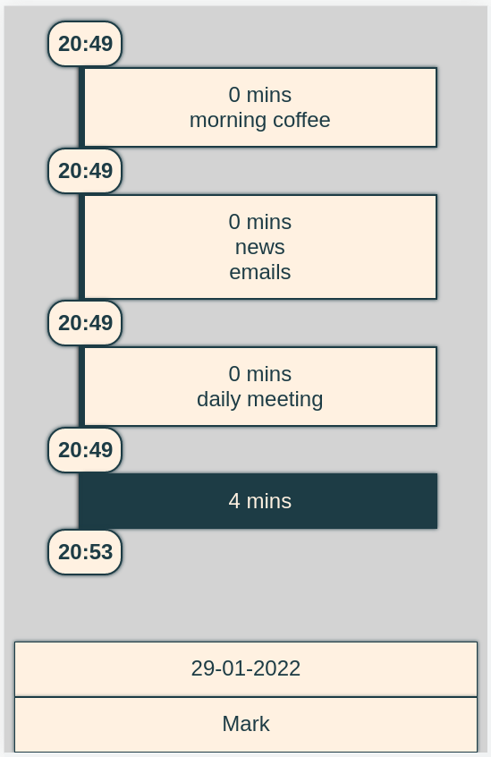
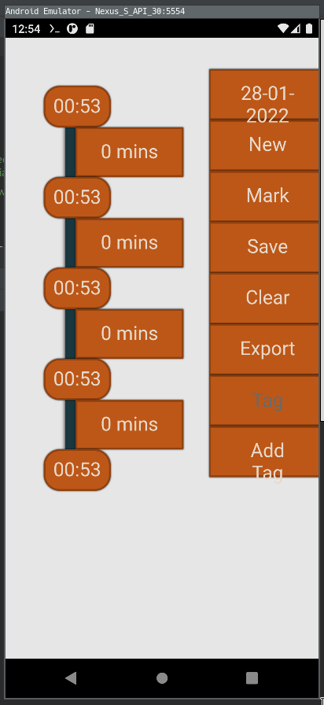

# timeline-app

A simple timeline journal built with vue.js and cordova.

Mark time points to create a timespan between, then add information about the
timespans as tags.



## Install and Build

If vue and cordova aren't installed:

```sh
$ npm install -g @vue/cli
$ npm install -g cordova
```

Add cordova plugin:

```sh
$ vue add cordova
```

Prepare the project:

```sh
$ npm run cordova-prepare # prepare for build (you can run this command, when you checkouted your project from GIT, it's like npm install) 
```

For Android:

```sh
$ npm run cordova-serve-android # Development Android 
$ npm run cordova-build-android # Build Android 
```

Test on browser:

```sh
$ npm run cordova-serve-browser # Development Browser 
```

## Screenshots

First run on mobile:


